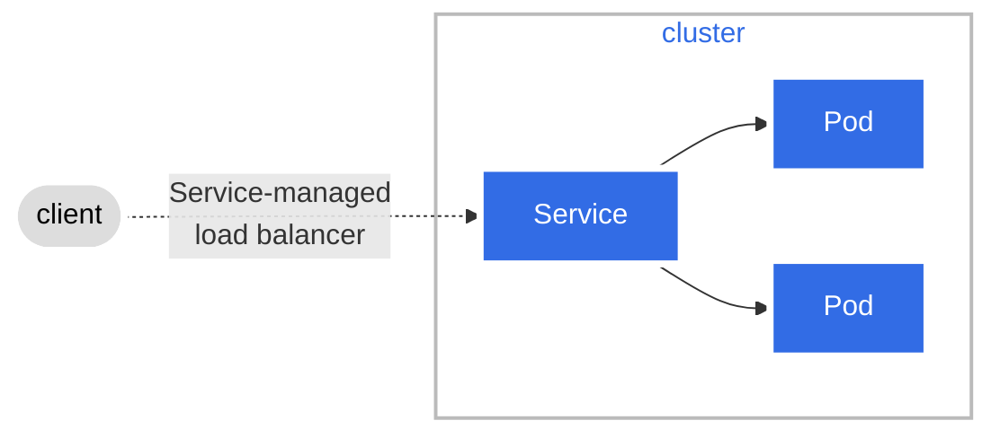

```shell
###stream logs (-f, --follow is for opening a stream):
kubectl logs -f -n test-serice-multiple services/demo

minikube service -n test-serice-multiple demo-a
minikube service -n test-serice-multiple demo-b

### Test:
curl {URL_FROM_OUTPUT}
```


```shell
echo "to communicate with LoadBalancer service, run (from within EC2 instance in the same VPN)
:"
curl <DNS-of-created-load-balancer>:<spec.ports.port>

echo "E.G."
curl k8s-test-demoa-51d794a2b3-af7daa31cbb4c67b.elb.eu-central-1.amazonaws.com:8888
```

```shell
# minikube is buggy in terms of DNS and service discovery:
kubectl logs --namespace=kube-system -l k8s-app=kube-dns
```


